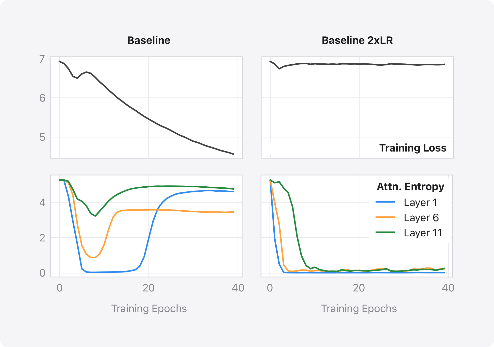

# Stabilizing Transformer Training by Preventing Attention Entropy Collapse

This software project accompanies the research paper, [Stabilizing Transformer Training by Preventing Attention Entropy Collapse](https://proceedings.mlr.press/v202/zhai23a/zhai23a.pdf), published at ICML 2023.

## Introduction
Transformers are difficult to train. In this work, we study the training stability of Transformers by proposing a novel lense named `Attention Entropy Collapse`. Attention Entropy is defined as the quantity 

$$\text{Ent}(A_i) = -\sum_{j=1}^T A_{i,j}\log(A_{i,j})$$

for an attention matrix $A$, with $A_{i,j}$ corresponding to the $i$ -th query and $j$ -th key/value, respectively. Our observation is that training instability often occurrs in conjunction with sharp decreases of the average attention entropy, and we denote this phenomenon as entropy collapse. This is illustrated in Figure below. 

<p align="center">

</p>


We provide both theoretical and emprical analyses to the entropy collapse phenomenon, and propose a simple fix named $\sigma$ Reparam, where we reparamaeterize all the weights in a Transformer with 


$$\widehat{W}=\frac{\gamma}{\sigma(W)}W$$


## Getting Started 

We provide two reference implementations. One in PyTorch, applied to the Vision Transformer (VIT) setting; and another in JAX, applied to speech recognition (ASR). Please refer to the [vision](vision) and [speech](speech) folders for details. The same PyTorch implementation was used for language modeling (LM) and machine translation (MT) experiments.

## BibTex

```
@inproceedings{zhai2023stabilizing,
  title={Stabilizing Transformer Training by Preventing Attention Entropy Collapse},
  author={Zhai, Shuangfei and Likhomanenko, Tatiana and Littwin, Etai and Busbridge, Dan and Ramapuram, Jason and Zhang, Yizhe and Gu, Jiatao and Susskind, Joshua M},
  booktitle={International Conference on Machine Learning},
  pages={40770--40803},
  year={2023},
  organization={PMLR}
}
```

